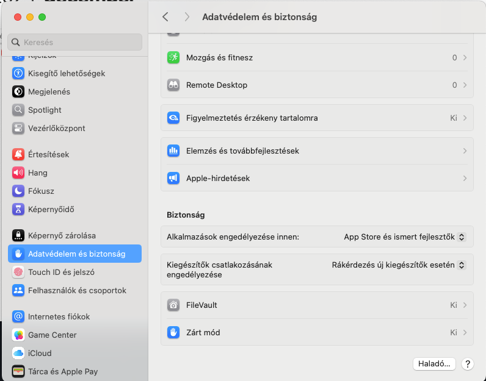

# Install

* Download JDK [jdk.java.net/archive/][jdk_java_net_archive]
* ```shell
  tar -xvf ~/Downloads/openjdk-13.0.2_osx-x64_bin.tar.gz
  sudo mv ~/Downloads/jdk-13.0.1.jdk /Library/Java/JavaVirtualMachines/
  ```
* .zshrc
  ```shell
  JAVA_VERSION=13.0.2
  JAVA_HOME="/Library/Java/JavaVirtualMachines/jdk-${JAVA_VERSION}.jdk/Contents/Home"
  export PATH="${JAVA_HOME}/bin:${PATH}"
  ```
* 

[jdk_java_net_archive]:<https://jdk.java.net/archive/>
